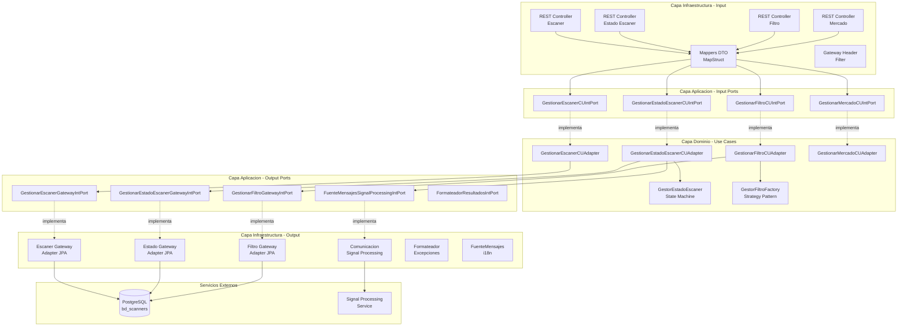
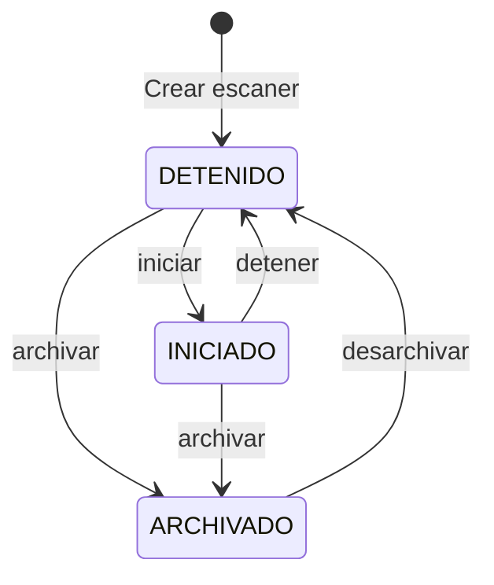

# Scanner Management Service

Microservicio de gestion de escaneadores de mercado para la plataforma **MeTradingPlat**. Permite crear, configurar y gestionar scanners con filtros tecnicos y fundamentales que se ejecutan sobre simbolos de distintos mercados.

## Tabla de Contenido

- [Arquitectura](#arquitectura)
- [Tecnologias](#tecnologias)
- [Estructura del Proyecto](#estructura-del-proyecto)
- [API Endpoints](#api-endpoints)
- [Sistema de Filtros](#sistema-de-filtros)
- [Maquina de Estados](#maquina-de-estados)
- [Base de Datos](#base-de-datos)
- [Configuracion](#configuracion)
- [Ejecucion](#ejecucion)

## Arquitectura

El servicio implementa **Arquitectura Hexagonal** (Puertos y Adaptadores) con patrones State y Strategy.



## Tecnologias

| Tecnologia | Version | Proposito |
|---|---|---|
| Java | 21 | Lenguaje principal (Virtual Threads) |
| Spring Boot | 3.5.9 | Framework |
| Spring Data JPA | - | Persistencia |
| PostgreSQL | 15 | Base de datos |
| Spring Cloud | 2025.0.0 | Eureka Client |
| MapStruct | 1.5.5 | Mapeo DTO <-> Dominio <-> Entidad |
| Lombok | - | Reduccion de boilerplate |
| Docker | Multi-stage | Contenedorizacion |

## Estructura del Proyecto

```
src/main/java/com/metradingplat/scanner_management/
├── application/
│   ├── input/                          # Puertos de entrada (interfaces)
│   │   ├── GestionarEscanerCUIntPort.java
│   │   ├── GestionarEstadoEscanerCUIntPort.java
│   │   ├── GestionarFiltroCUIntPort.java
│   │   ├── GestionarMercadoCUIntPort.java
│   │   └── FilterStrategyPort.java
│   └── output/                         # Puertos de salida (interfaces)
│       ├── GestionarEscanerGatewayIntPort.java
│       ├── GestionarEstadoEscanerGatewayIntPort.java
│       ├── GestionarFiltroGatewayIntPort.java
│       ├── GestorEstrategiaFiltroIntPort.java
│       ├── FuenteMensajesIntPort.java
│       ├── FuenteMensajesSignalProcessingIntPort.java
│       └── FormateadorResultadosIntPort.java
├── domain/
│   ├── enums/
│   │   ├── EnumEstadoEscaner.java      # ARCHIVADO, INICIADO, DETENIDO, DESARCHIVADO
│   │   ├── EnumFiltro.java             # 40+ tipos de filtros
│   │   ├── EnumCategoriaFiltro.java    # VOLUMEN, PRECIO, VOLATILIDAD, MOMENTUM, TIEMPO, FUNDAMENTALES
│   │   ├── EnumMercado.java            # NYSE, NASDAQ, AMEX, ETF, OTC
│   │   ├── EnumParametro.java
│   │   ├── EnumTipoEjecucion.java
│   │   ├── EnumTipoValor.java          # FLOAT, INTEGER, STRING, CONDICIONAL
│   │   └── valores/                    # Enums especializados (condicionales, patrones, etc.)
│   ├── models/                         # Modelos de dominio
│   │   ├── Escaner.java
│   │   ├── EstadoEscaner.java
│   │   ├── Filtro.java
│   │   ├── Parametro.java
│   │   ├── Valor.java                  # Polimorfismo: ValorFloat, ValorInteger, ValorString, ValorCondicional
│   │   ├── Mercado.java
│   │   └── CategoriaFiltro.java
│   ├── states/                         # Patron State
│   │   ├── IEstadoEscaner.java
│   │   ├── GestorEstadoEscaner.java
│   │   ├── EstadoEscanerIniciado.java
│   │   ├── EstadoEscanerDetenido.java
│   │   └── EstadoEscanerArchivado.java
│   └── usecases/                       # Adaptadores de casos de uso
│       ├── GestionarEscanerCUAdapter.java
│       ├── GestionarEstadoEscanerCUAdapter.java
│       ├── GestionarFiltroCUAdapter.java
│       └── GestionarMercadoCUAdapter.java
└── infrastructure/
    ├── business/                       # Estrategias de filtros (41 implementaciones)
    │   ├── factory/
    │   │   ├── IFiltroFactory.java
    │   │   └── GestorFiltroFactory.java
    │   ├── strategies/
    │   │   ├── volumen/
    │   │   ├── precio/
    │   │   ├── volatilidad/
    │   │   ├── momentum/
    │   │   ├── tiempo/
    │   │   └── fundamentales/
    │   └── validation/
    ├── configuration/
    │   ├── BeanConfigurations.java
    │   └── JpaConfiguration.java
    ├── input/
    │   ├── controllerGestionarEscaner/
    │   ├── controllerGestionarEstadoEscaner/
    │   ├── controllerGestionarFiltro/
    │   ├── controllerGestionarMercado/
    │   └── filter/                     # GatewayHeaderFilter
    └── output/
        ├── exceptionsController/       # Manejo global de errores
        ├── persistence/
        │   ├── entity/                 # Entidades JPA
        │   ├── mapper/                 # Mappers Entidad <-> Dominio
        │   └── repository/             # Spring Data repositories
        ├── external/                   # Comunicacion con Signal Processing
        └── i18n/                       # Internacionalizacion
```

## API Endpoints

Base path: `/api/escaner`

### Escaner (CRUD)

| Metodo | Path | Descripcion |
|---|---|---|
| `POST` | `/api/escaner` | Crear escaner |
| `GET` | `/api/escaner` | Listar escaneres activos (no archivados) |
| `GET` | `/api/escaner/{id}` | Obtener escaner por ID |
| `GET` | `/api/escaner/archivados` | Listar escaneres archivados |
| `GET` | `/api/escaner/iniciados` | Listar escaneres iniciados |
| `PUT` | `/api/escaner/{id}` | Actualizar escaner |
| `DELETE` | `/api/escaner/{id}` | Eliminar escaner |

### Estado del Escaner

| Metodo | Path | Descripcion |
|---|---|---|
| `POST` | `/api/escaner/estado/{id}/iniciar` | Iniciar escaner |
| `POST` | `/api/escaner/estado/{id}/detener` | Detener escaner |
| `POST` | `/api/escaner/estado/{id}/archivar` | Archivar escaner |
| `POST` | `/api/escaner/estado/{id}/desarchivar` | Desarchivar escaner |

### Filtros

| Metodo | Path | Descripcion |
|---|---|---|
| `GET` | `/api/escaner/filtro/categorias` | Obtener categorias de filtros |
| `GET` | `/api/escaner/filtro?categoria={cat}` | Obtener filtros por categoria |
| `GET` | `/api/escaner/filtro/defecto?filtro={filtro}` | Obtener filtro con valores por defecto |
| `GET` | `/api/escaner/filtro/escaner/{idEscaner}` | Obtener filtros guardados de un escaner |
| `POST` | `/api/escaner/filtro/escaner/{idEscaner}` | Guardar filtros de un escaner |

### Mercados

| Metodo | Path | Descripcion |
|---|---|---|
| `GET` | `/api/escaner/mercado` | Listar mercados disponibles |

## Sistema de Filtros

El servicio implementa un **Strategy Pattern** con 41 estrategias de filtros organizadas en 6 categorias:

| Categoria | Filtros |
|---|---|
| **Volumen** | Volume, Average Volume, Volumen Post/Pre, Relative Volume, Relative Volume Same Time, Volume Spike |
| **Precio y Movimiento** | Change, % Change, Precio, Gap From Close, Position In Range, % Range, Range Dollars, Crossing Above/Below, Halt |
| **Volatilidad** | ATR, ATRP, Relative Range |
| **Momentum** | RSI, Distance From VWAP/EMA/MA, Back To EMA Alert, Through EMA/VWAP Alert, EMA/VWAP Support Resistance |
| **Tiempo y Patrones** | Bearish/Bullish Engulfing, Consecutive Candles, First Candle, High/Low of Day, New Candle High/Low, % Pullback, Break Over Recent Highs/Lows, ORB/ORBreakout, Pivots, Minutes In Market |
| **Fundamentales** | Float, Shares Outstanding, Market Cap, Short Interest, Short Ratio, Days Until Earnings, Noticias |

Cada filtro tiene parametros tipados (`Float`, `Integer`, `String`, `Condicional`) con valores por defecto y validacion automatica.

## Maquina de Estados



- Al **iniciar** un escaner se notifica al Signal Processing Service via REST
- Al **detener** se envia notificacion de detencion
- Se requieren **filtros configurados** para poder iniciar un escaner
- Bloqueo optimista con campo `version` para concurrencia

## Base de Datos

```mermaid
erDiagram
    ESCANER ||--|| ESTADO_ESCANER : tiene
    ESCANER ||--o{ FILTRO : contiene
    ESCANER }o--|| TIPO_EJECUCION : usa
    ESCANER }o--o{ MERCADO : escanea
    FILTRO ||--o{ PARAMETRO : tiene
    PARAMETRO ||--|| VALOR : contiene

    ESCANER {
        Long idEscaner PK
        String nombre UK
        String descripcion
        LocalTime horaInicio
        LocalTime horaFin
    }
    ESTADO_ESCANER {
        Long idEscaner PK_FK
        Enum estado
        Long version
    }
    FILTRO {
        Long idFiltro PK
        Enum enumFiltro
        Long idEscaner FK
    }
    PARAMETRO {
        Long idParametro PK
        Enum enumParametro
        Long idFiltro FK
    }
    VALOR {
        Long idValor PK
        String tipo
    }
```

- **Motor**: PostgreSQL 15
- **Base de datos**: `bd_scanners`
- **DDL**: `hibernate.ddl-auto: update`
- **Datos iniciales**: `import.sql` (mercados y tipos de ejecucion)

## Configuracion

### Variables de Entorno

| Variable | Descripcion | Default |
|---|---|---|
| `DB_HOST` | Host de PostgreSQL | `postgres-scanners` |
| `DB_PORT` | Puerto de PostgreSQL | `5432` |
| `DB_NAME` | Nombre de la BD | `bd_scanners` |
| `POSTGRES_USER` | Usuario PostgreSQL | - |
| `POSTGRES_PASSWORD` | Password PostgreSQL | - |
| `EUREKA_HOST` | Host de Eureka | `directory` |

### Perfiles de Spring

- **dev**: PostgreSQL en localhost:5432, Eureka en localhost:8761
- **prod**: Configuracion via variables de entorno del docker-compose

### Internacionalizacion

Soporta mensajes en espanol (`es`) e ingles (`en`) para mensajes de validacion, etiquetas de filtros y errores.

## Ejecucion

### Con Docker Compose

```bash
# Desde la raiz de metradingplat/
docker compose up -d scanner-management-service
```

Disponible en `http://localhost:8081` (directo) o `http://localhost:8080/api/escaner` (via Gateway).

### Desarrollo Local

```bash
cd scanner-management-service

# Requiere Java 21, Maven, PostgreSQL con BD bd_scanners
mvn spring-boot:run -Dspring-boot.run.profiles=dev
```
